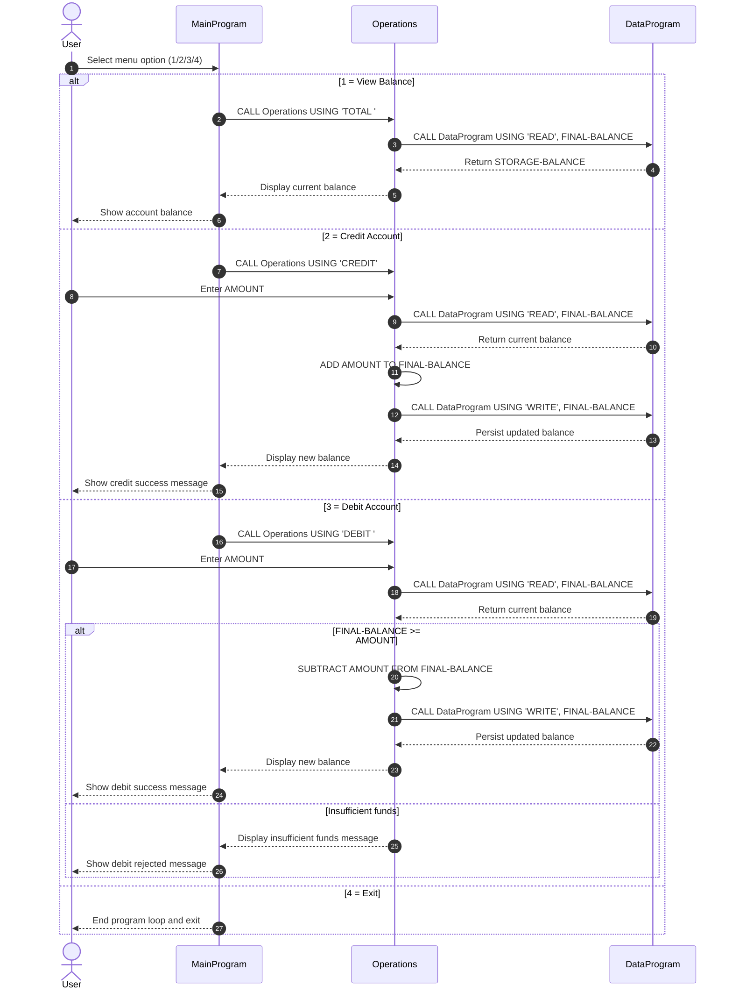

# Student Account COBOL Documentation

This document describes the COBOL programs in `src/cobol/` and how they work together to manage a student account balance.

## File Overview

### `src/cobol/main.cob` (`MainProgram`)

Purpose:
- Provides the interactive menu for account operations.
- Routes the user's choice to the operations module.

Key logic:
- Displays a looped menu with these options:
    - `1` View balance
    - `2` Credit account
    - `3` Debit account
    - `4` Exit
- Calls `Operations` with an operation code:
    - `'TOTAL '` for balance inquiry
    - `'CREDIT'` to add funds
    - `'DEBIT '` to subtract funds
- Uses `CONTINUE-FLAG` to continue or stop the menu loop.

### `src/cobol/operations.cob` (`Operations`)

Purpose:
- Executes business operations requested by `MainProgram`.
- Coordinates reads and writes through `DataProgram`.

Key logic:
- Receives `PASSED-OPERATION` from caller and stores it in `OPERATION-TYPE`.
- `TOTAL` flow:
    - Calls `DataProgram` with `'READ'` to get the current balance.
    - Displays current balance.
- `CREDIT` flow:
    - Accepts credit amount from the user.
    - Reads current balance.
    - Adds amount to balance.
    - Calls `DataProgram` with `'WRITE'` to persist the new balance.
- `DEBIT` flow:
    - Accepts debit amount from the user.
    - Reads current balance.
    - Only subtracts and writes when funds are sufficient.
    - Displays an insufficient funds message when debit exceeds balance.

### `src/cobol/data.cob` (`DataProgram`)

Purpose:
- Acts as the account balance storage layer.
- Exposes a simple read/write interface to other programs.

Key logic:
- Maintains `STORAGE-BALANCE` in working storage (initialized to `1000.00`).
- Supports two operation types:
    - `'READ'`: moves internal `STORAGE-BALANCE` into caller-provided `BALANCE`.
    - `'WRITE'`: moves caller-provided `BALANCE` into internal `STORAGE-BALANCE`.

## Student Account Business Rules

- Single account model: the programs manage one in-memory student account balance.
- Starting balance: account begins at `1000.00`.
- Operation codes are fixed-length text values and must match exactly:
    - `'TOTAL '`, `'CREDIT'`, `'DEBIT '`, `'READ'`, `'WRITE'`.
- Credits increase balance by the entered amount.
- Debits are allowed only when `FINAL-BALANCE >= AMOUNT`.
- If debit amount is greater than available balance, no update is written.
- Balance changes persist only for the lifetime of the program run (no file/database persistence).

## Program Interaction Flow

1. User selects an option in `MainProgram`.
2. `MainProgram` calls `Operations` with an operation code.
3. `Operations` calls `DataProgram` to read/write balance.
4. `Operations` returns control to `MainProgram`.
5. Menu repeats until user exits.

## App Data Flow (Sequence Diagram)

